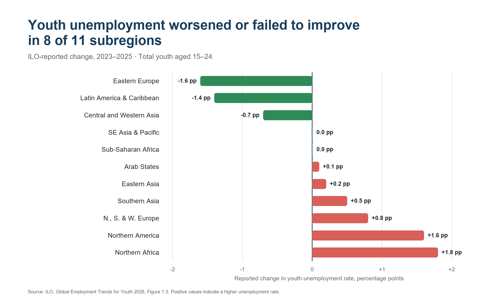

# Youth Unemployment | ILO 2026 Report

A reproducible analysis of youth unemployment using International Labour Organization estimates for **2016–2025** and the ILO-reported **2023–2025 percentage-point changes**. The repository keeps the reviewable Excel evidence layer and Power BI Project in separate folders.

**2025 in the repository name is the latest year measured; 2026 is the report publication year.**

## Main finding

The global youth unemployment rate was almost unchanged between 2023 and 2025—**12.3% to 12.4%**—but the regional recovery was uneven. Among the 11 ILO subregions, youth unemployment:

- increased in 6;
- was unchanged in 2;
- decreased in 3.

The supported summary is therefore: **youth unemployment worsened or failed to improve in 8 of 11 subregions between 2023 and 2025**.



[Download the chart PNG](data/data-plot.png) · [Review the Excel evidence layer](excel/youth-unemployment.xlsx) · [Open the Power BI Project](power-bi/youth-unemployment-dashboard.pbip) · [Read the LinkedIn draft](docs/linkedin-post.docx)

## Review and publication status

This branch contains a **local review candidate**. The Excel workbook and the text-based PBIP/TMDL project are ready for inspection, but the Power BI report has not yet been published.

Publication is intentionally gated:

1. Open and refresh the PBIP in Power BI Desktop.
2. Review the desktop canvas.
3. Switch to Mobile layout and review the phone reading order.
4. Approve or request changes.
5. Only after approval, publish to **My workspace** and add the Power BI Service link here.

> **Power BI Service report:** pending local approval. The final project will use a responsive link card/button, not an embedded iframe.

## Repository structure

```text
README.md
LICENSE
LICENSE-CC-BY-4.0
THIRD_PARTY_NOTICES.md
data/
  data-plot.png
docs/
  linkedin-post.docx
excel/
  youth-unemployment.xlsx
power-bi/
  youth-unemployment-dashboard.pbip
  youth-unemployment-dashboard.Report/
  youth-unemployment-dashboard.SemanticModel/
```

The separation is deliberate:

- `excel/` contains the auditable evidence layer.
- `power-bi/` contains the editable report and semantic model.
- `docs/` contains communication deliverables.
- `data/` contains the static chart used on GitHub and social channels.
- `.review/` is local-only and excluded from Git.

## Excel evidence layer

[youth-unemployment.xlsx](excel/youth-unemployment.xlsx) contains three structured tables.

### `Rates`

Named table: `YouthRates`

| Field | Meaning |
| --- | --- |
| `Region` | World or one of 11 ILO subregions |
| `RegionType` | `World` or `Subregion` |
| `Year` | 2016–2025 |
| `AgeGroup` | 15–24 |
| `Sex` | Total |
| `YouthUnemploymentRate` | Share of the youth labour force, stored as a decimal fraction |
| `UnemployedPeople` | Approximate world count where reported; otherwise blank |
| `EstimateStatus` | ILO modelled estimate |

The table contains **120 unique region-year observations**: 12 geographies × 10 years.

### `Change 2023-2025`

Named table: `ReportedChanges`

This table stores the percentage-point changes printed in ILO Figure 1.3 for total youth, men and women. These values are kept separately because they must not be reconstructed from annual rates rounded to one decimal place. For example, the annual Northern America values round to 8.3% and 9.8%, while the ILO reports a change of **+1.6 percentage points**.

### `Sources`

The source register documents coverage, the metric denominator, permitted claims, rounding rules and prohibited causal overclaims.

## Power BI Desktop review

1. Clone or download the entire repository.
2. Open [youth-unemployment-dashboard.pbip](power-bi/youth-unemployment-dashboard.pbip) in a compatible Power BI Desktop version.
3. In **Transform data → Manage parameters**, set `DataFilePath` to the absolute location of `excel/youth-unemployment.xlsx` on your computer. The committed default points to the author's local review copy.
4. Apply changes and refresh. A fresh clone must refresh because local model caches are excluded from Git.
5. Review the `Dashboard` page in desktop view.
6. Open **View → Mobile layout** and review the phone layout.

The semantic model uses two import tables:

- `Rates`: annual 2016–2025 estimates;
- `Changes`: ILO-reported 2023–2025 percentage-point changes.

Explicit measures prevent accidental summation of rates:

- `Youth Unemployment Rate 2025`
- `World Youth Unemployment Rate 2025`
- `Unemployed Youth 2025`
- `Reported Change 2023-2025`
- `Stalled or Worsened Subregions`

The desktop page contains two regional bar charts and three KPI cards. Every visual also has a phone-layout position on a 320-pixel-wide canvas.

## Analytical method

### 1. Evidence lock

The analysis was constrained before charting:

- primary source: corrected accessible ILO report dated 31 August 2026;
- rate source: Table A.1;
- change source: Figure 1.3;
- population: ages 15–24;
- denominator: youth labour force, not all youth;
- public period: 2016–2025;
- projections for 2026–2027 excluded.

### 2. Validation controls

The workbook was checked for grain, uniqueness, coverage and headline values:

| Control | Expected |
| --- | ---: |
| Annual rate rows | 120 |
| Unique region-year pairs | 120 |
| Reported change rows | 36 |
| Global rate, 2023 | 12.3% |
| Global rate, 2025 | 12.4% |
| Unemployed youth, 2025 | approximately 67 million |
| Subregions increased / unchanged / decreased | 6 / 2 / 3 |

### 3. Interpretation limits

- A low unemployment rate does not necessarily mean a healthy youth labour market; inactivity, informality and insecure work may coexist with it.
- The analysis describes levels and reported changes. It does not identify causal effects.
- Do not attribute the changes to AI or any other single factor.
- World and subregional values overlap and must not be added together.
- Blank regional counts mean unavailable, not zero.

## How the skills were used

### Christian Data Analyst

The project follows an evidence-to-decision workflow:

1. **Frame the question:** did the youth unemployment recovery continue evenly after 2023?
2. **Lock the evidence:** identify the authoritative tables, definitions, grain, rounding and permissible claims.
3. **Validate quantitatively:** test row counts, uniqueness, direction counts and selected control values before visual design.
4. **Visualize the decision-relevant contrast:** show the nearly flat global headline alongside divergent regional change.
5. **State uncertainty and limits:** separate description from causation and document what the metric does not capture.
6. **Stage release:** keep local review, online publication and merge as separate gates.

### LinkedIn Data Storyteller

The LinkedIn deliverable was built as a mobile-first professional story:

1. Draft three evidence-backed hooks.
2. Choose one tension: a stable global average hides a stalled regional recovery.
3. Use only a few memorable numbers: 12.4%, approximately 67 million, and 8 of 11.
4. Use percentage points correctly and name the denominator.
5. Keep paragraphs short and include a three-line regional direction summary.
6. Avoid unsupported causal language.
7. End with a focused discussion question rather than a generic engagement prompt.

The resulting English post and alternative hooks are in [docs/linkedin-post.docx](docs/linkedin-post.docx). The [previously published LinkedIn post](https://www.linkedin.com/posts/thedatadisciple_you-need-experience-to-get-a-job-but-how-activity-7504525000364838915-5rXB) remains available as a historical version; it is not the copy proposed by this review branch.

## Sources

- [ILO — Global Employment Trends for Youth 2026: Back to the future](https://www.ilo.org/publications/major-publications/global-employment-trends-youth-2026-back-future)
- [Corrected accessible report PDF](https://www.ilo.org/sites/default/files/2026-09/9789220437612_PDFA_Web_ENG.pdf)
- [ILOSTAT](https://ilostat.ilo.org/) for broader labour statistics research

## License and attribution

Copyright (c) 2026 Dmytro Klymchuk (TheDataDisciple), for original contributions to the extent copyright applies.

| Material | License and scope |
| --- | --- |
| Original software and model logic, including Power Query M, DAX, TMDL and project configuration | [MIT](LICENSE) |
| Original prose in `README.md` and `docs/linkedin-post.docx` | [CC BY 4.0](LICENSE-CC-BY-4.0), excluding third-party material |
| Original chart/report/workbook presentation | [CC BY 4.0](LICENSE-CC-BY-4.0), only to the extent of the author's rights |
| ILO data and bundled Microsoft themes | Their respective third-party terms; see [THIRD_PARTY_NOTICES.md](THIRD_PARTY_NOTICES.md) |

Attribute the statistical source separately to the **International Labour Organization**. This independent project is not affiliated with or endorsed by the ILO or Microsoft.
